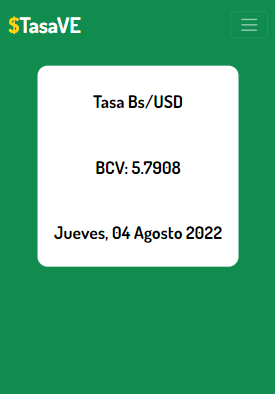

# TasaVE

A simple website that works with a custom-made API to access the current USD/Bs. exchange rate.

The website is made up of:
-Python
-Flask
-HTML, CSS, JS
-Bootstrap

You can access it at https://tasave.herokuapp.com/
